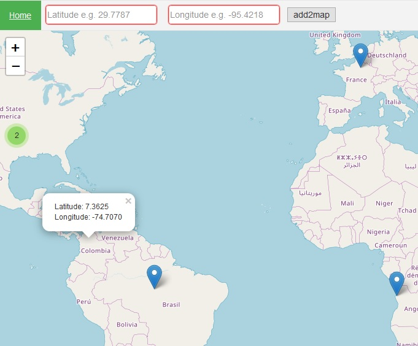

# What is add2map?
add2map is a code sample to use Folium geolocation without running python.
# How does it works?
download the add2map.html file, open in the browser, and enter coordinates to add a pointer in the map.
# Who uses it?
Those who wants to add geolocation capabilities to their project.
# What is it goals?
Facilitate the use of Folium geolocation.
# Screenshot
<table>
  <tr>
    <td>
      
    </td>
  </tr>
</table>
